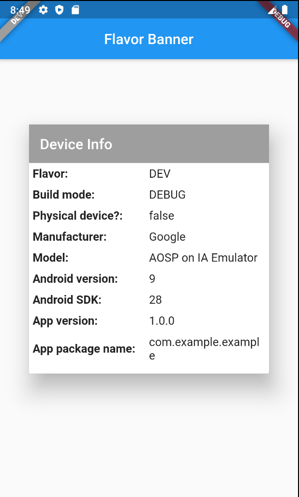

# flavorbanner

Flavor Banner is a package that make easy to configure flavors and add a banner to show info about device.

## ScreenShots




## Usage


- install

Add to yaml


```yaml
dependencies:
  flavorbanner: $latest_version
```

- create mains

You have to create different mains for your flavors, for example:

main_test.dart

main_development.dart

main_staging.dart

main_production.dart

- import

```dart
import 'package:flavorbanner/flavorbanner.dart'
```

- create mains

Each one of your mains have to look like this:

```dart
void main() {
  FlavorConfig(
    flavor: Flavor.DEV,
    color: Colors.grey,
    values: FlavorValues(
      baseUrl: "https://dev.com/",
      showBanner: true,
    ),
  );
  runApp(MyApp());
}
```

The allowed flavor types are TEST, DEV, STAGING, PROD

```dart
enum Flavor { TEST, DEV, STAGING, PROD }
```

You usually does not want to show banner in production so you can set showbanner value to false.

```dart
void main() {
  FlavorConfig(
    flavor: Flavor.PROD,
    color: Colors.grey,
    values: FlavorValues(
      baseUrl: "https://dev.com/",
      showBanner: false,
    ),
  );
  runApp(MyApp());
}
```

- wrap app in FlavorBanner

In order to show your banner in all pages you have to update your materialApp builder like this

```dart
class MyApp extends StatelessWidget {
  @override
  Widget build(BuildContext context) {
    return MaterialApp(
      home: FirstPage(),
      builder: (context, child) => FlavorBanner(
        child: child,
      ),
    );
  }
}
```

- use values

By default, you can only set baseUrl and showbanner per flavor. You can get this configuration in any place of your app using this:

```dart
Text(FlavorConfig.instance.values.baseUrl)
```

- extend values

You can use your own config values, for example:

```dart
import 'package:flavorbanner/flavorbanner.dart'

class CustomValues extends FlavorValues {
  CustomValues({
    this.baseUrl,
    this.showBanner = false,
    this.mapsApiKey,
  }) ;

  final String baseUrl, mapsApiKey;
  final bool showBanner;
}
```

Then you can use this in your main:

```dart
void main() {
  FlavorConfig(
    flavor: Flavor.PROD,
    color: Colors.red,
    values: CustomValues(
      baseUrl: "https://prod.com/",
      mapsApiKey: 'mapsApiKey',
    ),
  );
  runApp(MyApp());
}
```

 


